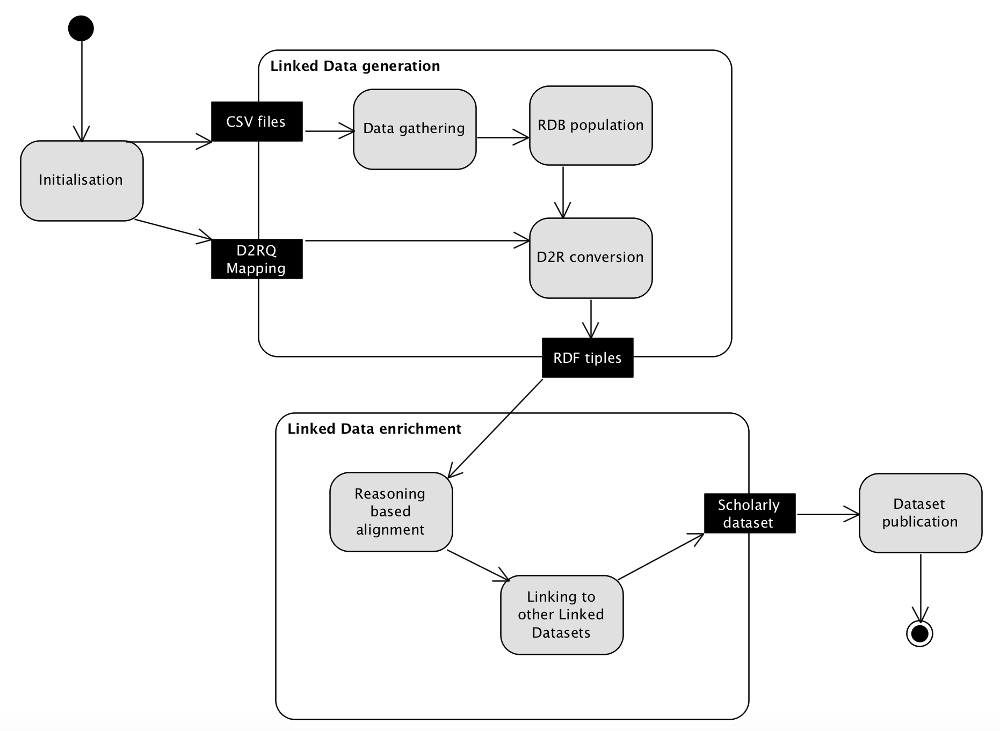

# cLODg2 -- conference Linked Open Data generator version 2

cLODg2 is the enhanced version of [cLODg](https://github.com/AnLiGentile/cLODg). It implements a methodology to produce Linked Data to describe a scientific conference and its publications, participants and events. To generate conference metadata we assume that you have initial data available (with some specific format). We then use use D2R conversion rules to produce metadata described with [Conference Ontology](http://w3id.org/scholarlydata/ontology/conference-ontology.owl). The workflow (modelled as an UML activity diagram in the following figure) includes two main activities, i.e., (i) Linked Data generation and (ii) Linked Data enrichment that start after an initialisation step required to customise the Linked Data generation process properly according to the inputs that consist of the CSV files containing the input data and the D2RQ mapping that will serve for converting CSV files to RDF.

The Linked Data generation activity is composed of the following actions (i.e., steps):
* __Data gathering__. This action allows the system to collect input data served as CSV files and. We remark that those data
are about a scientific event like a conference or a workshop and come from a conference management
system;
* __RDB populuation__. This action aims at populating a relational database (RDB) from the CSV files gathered from the previous action. The RDB is based on [HyperSQL](http://hsqldb.org/), which is a lightweight open-source Java
database;
* __D2R conversion__. The previous action, i.e., RDB population, is preparatory
to this step. In fact, cLODg2 relies on the D2R framework to perform the conversion of a non-RDF source to RDF. The conversion is guided by the mapping provided as input. This mapping is described by using the D2RQ mapping language. cLODg2 is released along with two D2RQ mapping formalisations: (i) to the [Semantic Web Dog Food](http://data.semanticweb.org/) (SWDF), thus compliant with its related [ontology](http://data.semanticweb.org/ns/swc/swc_2009-05-09.html); (ii) to [Scholarlydata](http://w3id.org/scholarlydata/), which is the evolution of the Semantic Web Dog Food based based on an improvement of the Semantic Web Conference Ontology, adopting best ontology design practices.

Similarly, the Linked Data enrichment activity is composed of the following actions:
* __Reasoning-based alignment__. Input of this action are the RDF triples produced by the Linked Data generation activity. The output is the materialisation of a set of RDF tiples that enable the alignemnt to other ontologies and vocabularies, i.e., the SWDF ontology, [SPAR ontologies](http://www.sparontologies.net/), [Dolce D0](http://www.ontologydesignpatterns.org/ont/dul/d0.owl), the [Organization Ontology](https://www.w3.org/TR/vocab-org/), [FOAF](http://xmlns.com/foaf/spec/), [SKOS](https://www.w3.org/TR/2005/WD-swbp-skos-core-spec-20051102/), [icatzd](http://www.w3.org/2002/12/cal/icaltzd), and the Collections Ontology. The alignment triples are materialised by means of OWL-DL reasoning, which is enabled by the [Apache Jena](https://jena.apache.org/) inference layer;
* __Linking to other Linked Datasets__. This action is aimed at producing instance level alignments, expressed via owl:sameAs axioms. The target linked datasets are [ORCID](http://orcid.org/) and [DOI](https://www.doi.org/). ORCID (Open Researcher and Contributor ID) provides persistent digital identifiers for scientific researchers and academic authors. A digital object identifier (DOI) is a serial code used to uniquely identify digital objects, particularly used for electronic documents. The alignments to ORCID are produced by relying on the public API provided by [ORCID](http://members.orcid.org/api/introduction-orcid-public-api). The references to DOI are produced by relying on the API provided by [Crossref](http://www.crossref.org/guestquery/), performing a search on each article title.

### How to run

Compile the maven package with

        mvn compile
        mvn package

Run the application with 

        java -jar target/clodg2-1.0.0-SNAPSHOT.jar --config <config file> --input <input_folder> --output <output_folder>

The arguments are the following:

| argument             | mandatory? | description                                                       |
|----------------------|------------|-------------------------------------------------------------------|
| -c,--config <file>   | MANDATORY  | Input file containing the app configuration.                      |
| -i,--input <folder>  | MANDATORY  | Folder containing the CSV with input data.                        |
| -m,--model <file>    | OPTIONAL   | The path to an input RDF model to merge with the output of cLODg. |
| -o,--output <folder> | MANDATORY  | Output directory used to store the final RDF models.              | 

### How to prepare the input data

Most of the input csv file (to include in a single folder, such as in `csv_samples`) can be downloaded from [easychair](https://easychair.org), under `Administration` \ `Workshop data download`.